# Project Overview

This project aims to provide a user authentication system using Google OAuth and traditional login methods in Django. It also allows users to update their profile data using JavaScript.

### Features

- User registration and login: Users can create an account and log in using their email address and password or their Google account via OAuth.

- Google OAuth integration: Users can authenticate themselves using their Google account credentials to streamline the login process.

- Profile creation: Upon registration, users can create their profile by providing personal information such as bio

- Profile editing: Users can update their profile information, including their First Name, Last Name, Email, and Bio using JavaScript to provide a smooth and dynamic user experience.

### Screenshots

Here are some screenshots showcasing the user register, login, and login via Google functionality, as well as profile creation and updating using JavaScript:

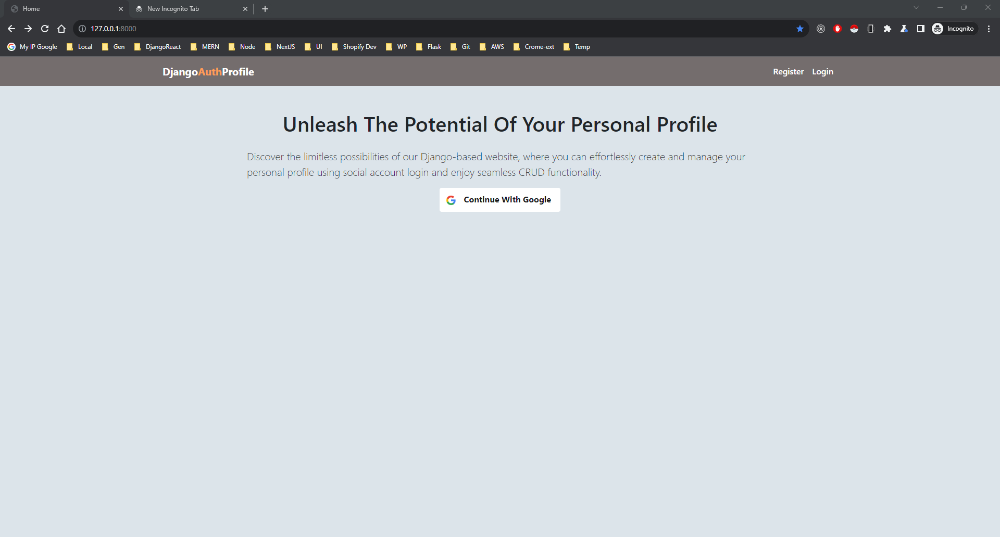
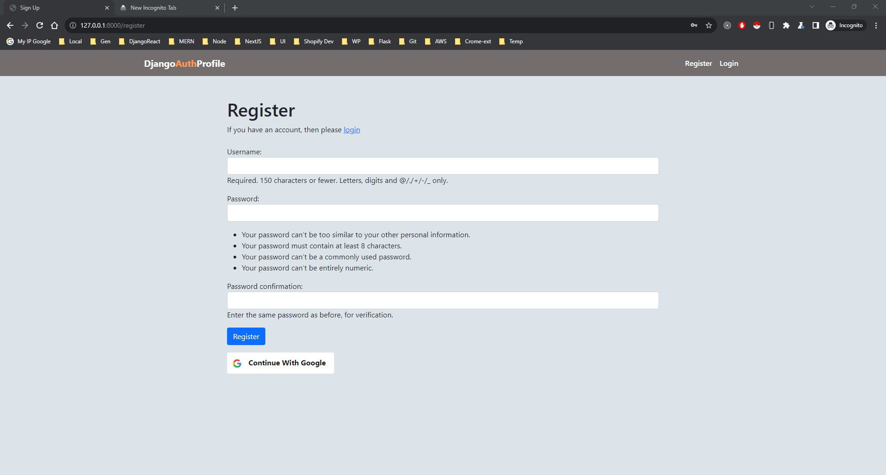
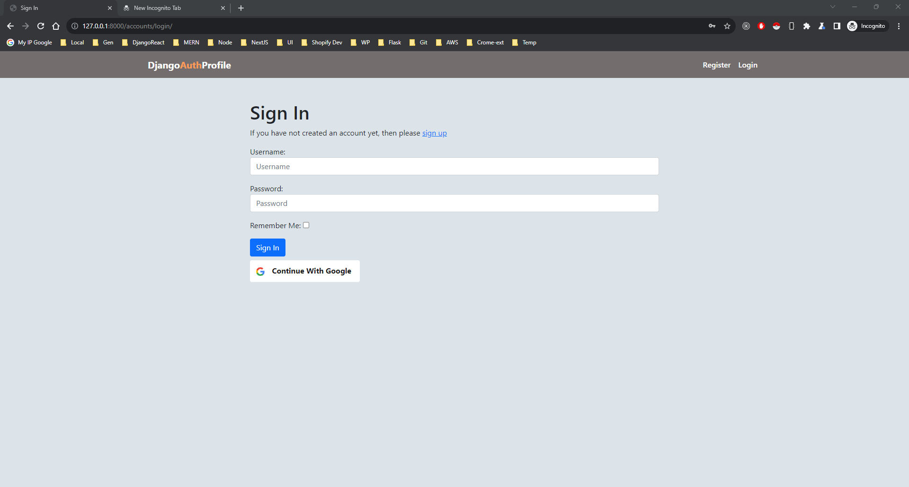
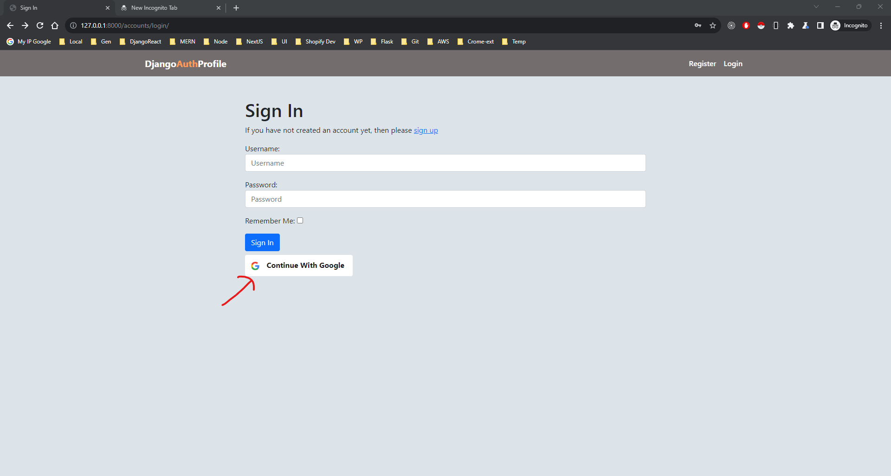
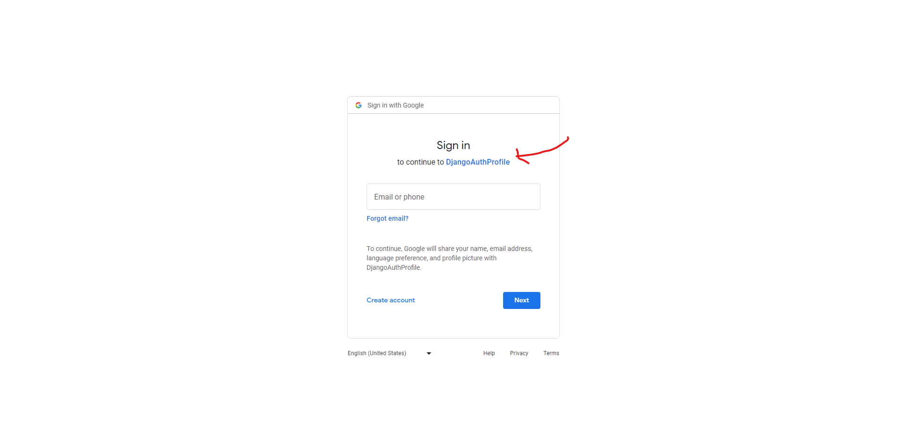
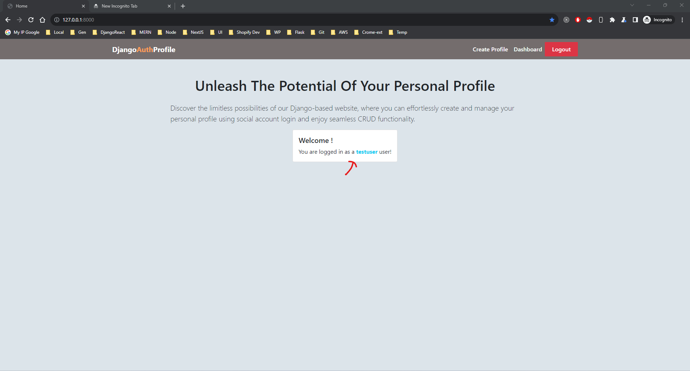
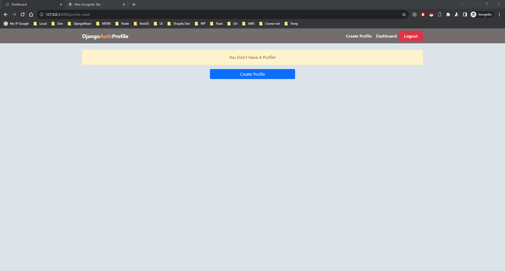
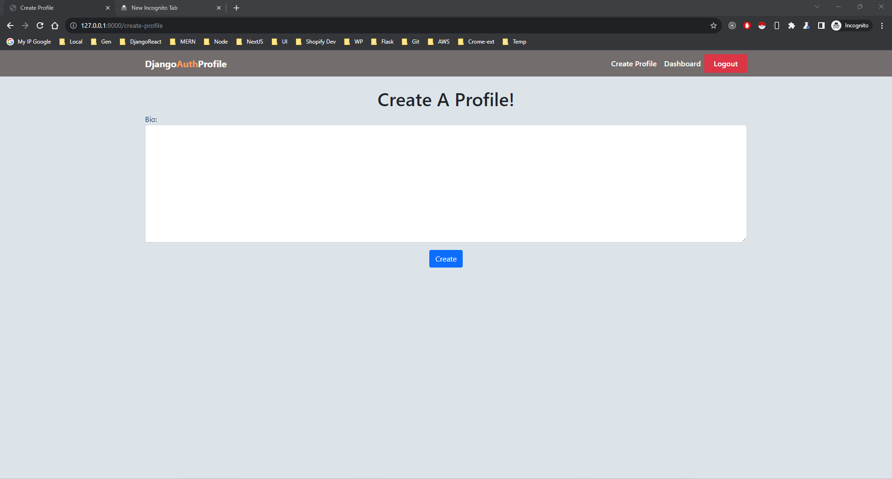
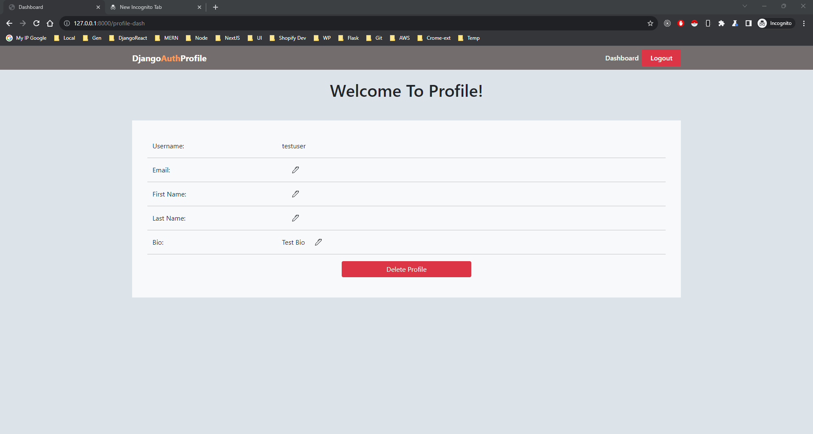
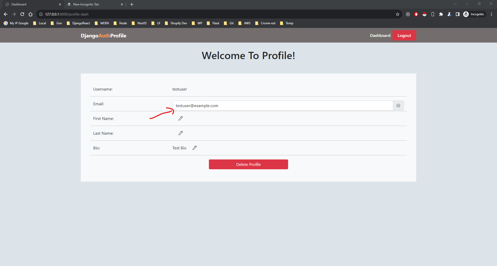
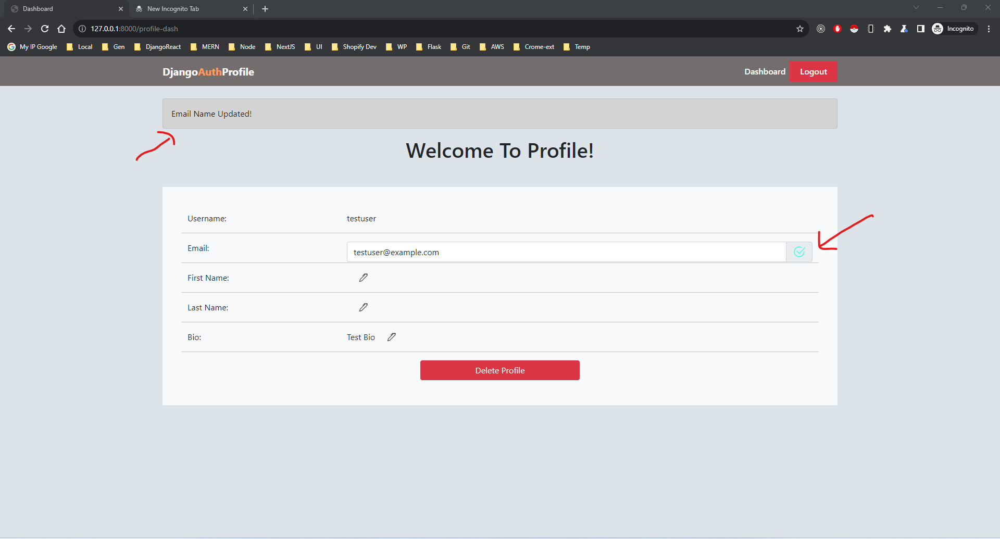
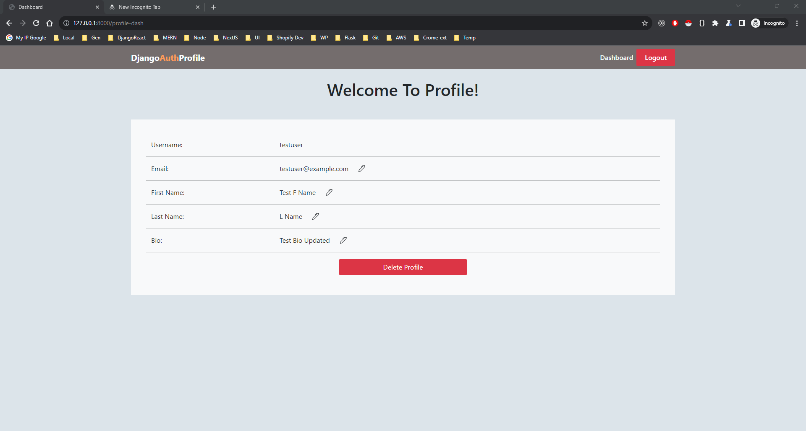
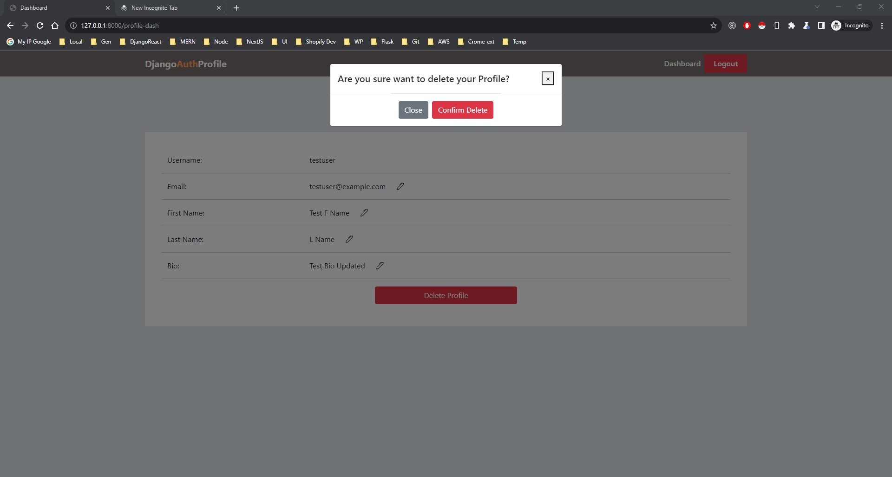
